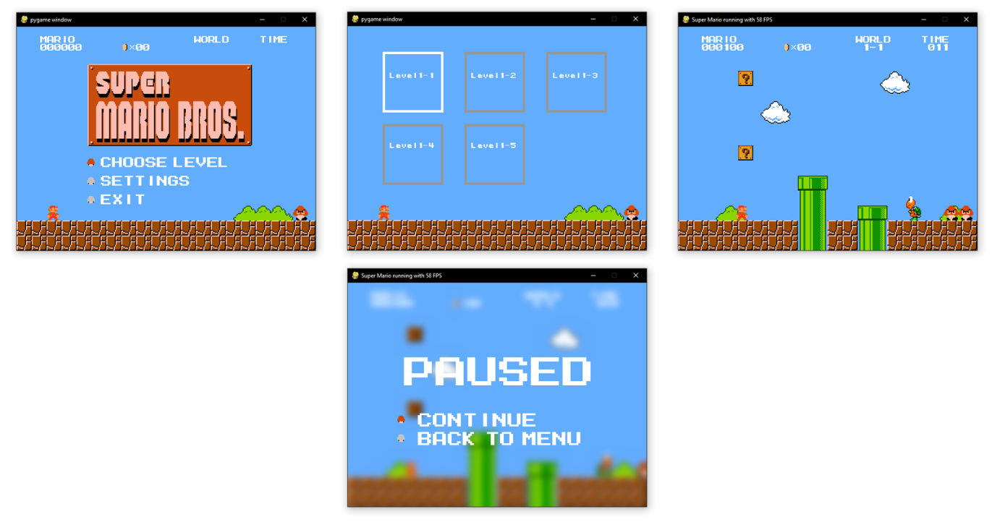

# Super Mario Implementation in Python

## Running

- $ pip install -r requirements.txt
- $ python main.py

## Standalone windows build

- $ pip install py2exe
- $ python compile.py py2exe

## Controls

- Left: Move left
- Right: Move right
- Space: Jump
- Shift: Boost
- Left/Right Mouseclick: secret

## Current State

## Dependencies

- pygame
- scipy

## Correct All .png Issues (RUN ALL CODE AT ONCE)

for f in $(find . -type f -name "\*.png")
do
echo "Processing $f ..."
convert $f -strip $f
done

## Contributions

I, Terrell D Lemons, want to give all the credit to a **Super Mario Bros** Tutorial in Udemy
